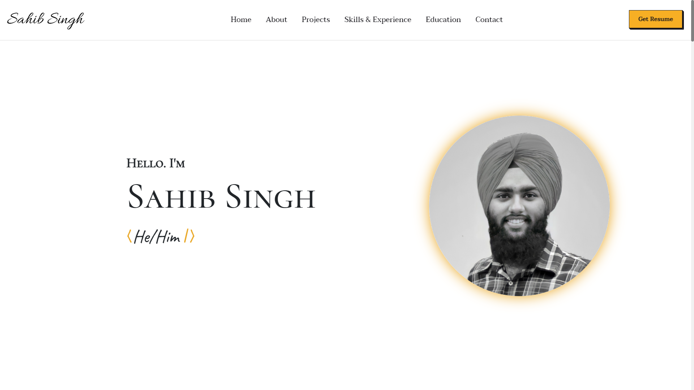

<p align="center">
  <a href="https://ssahibsingh.github.io/">
    <h2 align="center">Sahib Singh</h2>
  </a>
</p> 
<p align="center">Full Stack Web Developer</p>




## :rocket: Quick start

**Run the site locally**

### Step 1: Clone The Repo

Fork the repository. then clone the repo locally by doing -

```bash
git clone https://github.com/ssahibsingh/ssahibsingh.github.io.git
```

### Step 2: Install Dependencies

cd into the directory

```bash
cd ssahibsingh.github.io
```

install all the dependencies
```bash
npm install
```

### Step 3: Start Development Server

Then start the development Server
```
npm run dev
```
After running the development server the site should be running on https://localhost:3000


## :open_file_folder: What's inside?

A quick look at the folder structure of this project.

    .
    ├── components
    │   ├───About
    │   ├───Contact
    │   ├───Education
    │   ├───Footer
    │   ├───Header
    │   ├───Navbar
    │   ├───Project
    │   ├───Skills
    │   └───index
    ├── data
    │   ├───about
    │   ├───education
    │   ├───project
    │   └───skillsExperience
    ├── pages
    │   ├───404
    │   ├───_app
    │   ├───_document
    │   ├───index
    │   └───resume
    ├── public
    │   ├───images
    │   ├───resume.pdf
    └── styles
        └───globals.css
